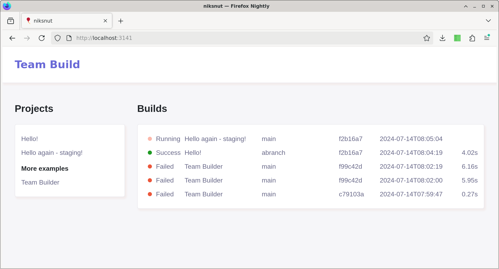
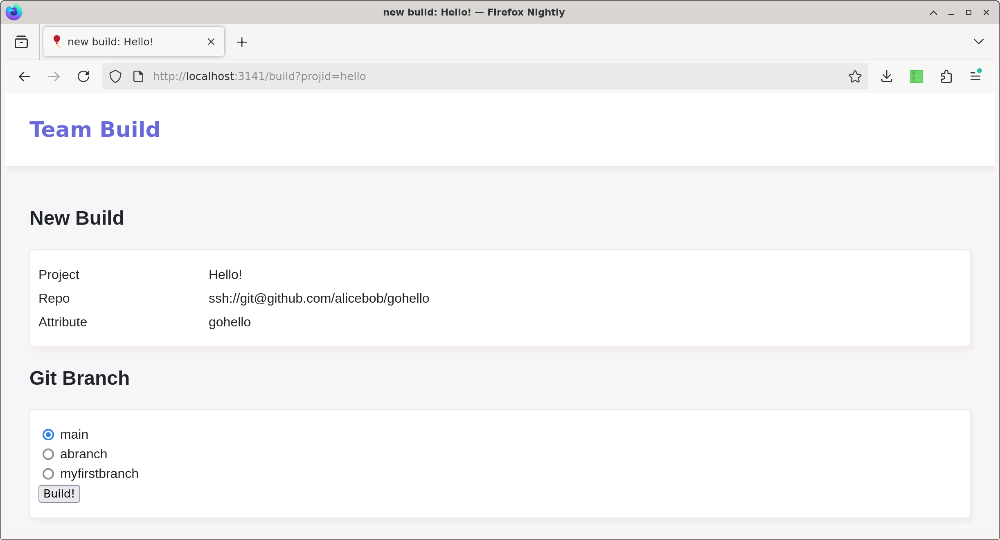
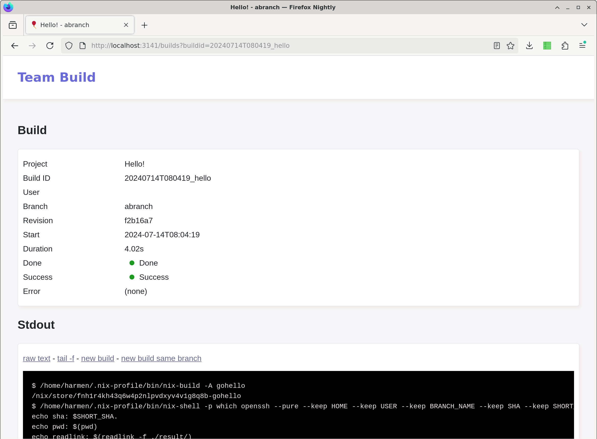

Team builder is the simplest possible, Nix based, build server.

You configure a list with projects, where each project is a git repo with a nix build, and a post build hook to do something with the build result.


Main use case (for me) is on demand build+push+kubectl docker containers on stag and prod environments.


### Main reasons this exists:

 - security: we block access to kubectl from everywhere except our build server. There are also no automated incoming actions to the team builder, so it's easy to lock it down.
 - vanilla nix: this runs on a "proper" server, not on containers. You get all the advantages from Nix with a persistent store. No need to mess around with the nix store (e.g. attic or cachix). It also keeps the use of cache.nixos.org to a minimum, which is just polite. And it makes build pretty fast.

This is not a CI system, I use github actions to do CI, but for production deploys I need more control about what and when.


### Example flow

The core of a build is:
 - click in the UI which project and which branch you want
 - we do a checkout of the branch
 - it runs the configured nix attribute. This is essentially `nix-build -A [what you configured]`.
 - if the main build is done this run the configured shell script, which is essentially `nix-shell -P [what you configured] [your shell]`. This can do scp or kubectl or whatever else you need.


### Nix

This uses only basic Nix commands, and currently doesn't support flakes (I don't use them).  There's no support for Lix, but that would be a good improvement.


### UI

The GUI works 100% without Javascript. Some things are slightly nicer with it, but it's not required. Also: no animations and it's as full screen as possible.

The CLI executable can also run builds, but it's not really intended as main thing (but you could use cron to schedule builds this way).


Example of the main page, which has on the left the list of projects you configured, and on the right the builds:<br />
<br />

Starting a new build goes by picking the branch you want:<br />
<br />

A build has some basic meta data, and the stdout logs (which streams if you have JS enabled):<br />
<br />


### Config file

The config file lists your projects. It's nix so you can use variables and expressions and imports, as long as in the end you get this structure:

```
{
  projects = [
    {
      id = "hello";
      name = "Hello!";
      category = "just for the UI"; 
      git = "ssh://git@github.com/alicebob/gohello;
      attribute = "gohello";
      packages = [
        "which"
        "openssh"
      ];
      post = ''
        echo which ssh: $(which ssh)
        echo ssh version: $(ssh -V)
        echo result: $(./result/bin/gohello)
      '';
    }
  ]
}
```

See ./config.nix as an example.

You can run `./niksnut --config=./yourconfig.nix check` to check it. Or you can run `nix-instantiate --strict --json --read-write-mode --eval ./config.nix` and see what that gives.

No yaml!


### Security

The build itself runs in Nix, so that uses the nix sandbox. The post-build script runs as the user you run the daemon as, but can only do what you configure here. This doesn't use containers, and has no other limitations. Limiting access to the http UI is on you. The main use case of this tool is for internal builds, it's not intended as a public build tool.

There are no incoming links, besides the UI. There's no explicit integration with any git website such as github.


### Secrets and keys

If you need ssh keys or kubectl access set up it's expected that the account under which team builder runs has the required access. In practise that means I add the ssh key to access github via nixos.


### Installation

You need a machine with nix installed, and then you need to set up a (system) account to run this. For nixos you need to add these packages: [pkgs.bash pkgs.git pkgs.nix pkgs.openssh]. Happy to give an example nixos config.

Web UI runs with: `niksnut --config=./config.nix --buildsdir=./builds/ httpd --listen=localhost:3141`

You'll want to setup a webserver with access control in front of this. I use nginx with letsencrypt and basic auth.

You can run builds outside with `./niksnut run yourproject main` if you want to test without UI.


### Maintenance

Builds older than 4 * 24 hours get deleted automatically. If you want to delete builds manually you can delete the directory from `./builds/runs/...`. There is no database, so that's all you need to do.

This never runs nix-collect-garbage.


### Links

We run this on a Hetzner cloud machine, works well (no referral, just a happy customer): https://www.hetzner.com/cloud/ . The smallest Google Cloud machines are really too weak to run anything useful.

See https://github.com/alicebob/gonix if you build Go programs and want to speed that up.

`crane` (`gcrane` if you run on Google cloud) is a nice util to push docker images you made with `pkgs.dockerTools.buildImage { ... }` to an image repository. Do use `compressor = "none";` to avoid unzipping with crane.


### Development

Normally all templates and static files are bundled in the binary, but they will be loaded from disk is you run: `./niksnut -root=. httpd`. You can also add `-offline` if your wifi is bad (but nix sometimes still wants to download things).

The unit tests do what you expect, and there are some "integration" tests which tests with a real git. See `make int`.

This project is called both "Team builder" and "niksnut".
